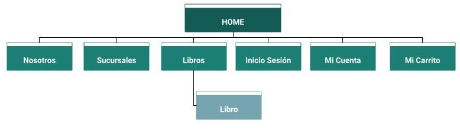

# PAWPrints-Ecommerce
PAWPrints es un proyecto de e-commerce para una librería, desarrollado en la materia Programación en Ambientes Web (PAW).

## SiteMap del Sitio

## Diseño de Wireframes low-fi en Figma
[Enlace del archivo de Wireframes](https://www.figma.com/design/r1uhDZ80PyjG3QK0Ar0c0D/Wireframe-low-fi?node-id=24-218&t=SqVjnf9t0aaQbzHD-1/)

## Maquetación del Sitio en HTML5 y CSS
